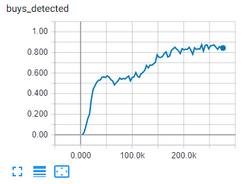

# NAYtrading.AI

This is the machine learning part of [N.A.Y.trading](https://github.com/chrwoizi/naytrading).

## :mortar_board: Training a Convolutional Neural Network on the recorded data

1. Install [Python 3](https://www.python.org/).

2. If you have an NVIDIA graphics card: Install the [graphics card driver](https://www.nvidia.com/Download/index.aspx?lang=en-us), [CUDA Toolkit 11.2.0](https://developer.nvidia.com/cuda-downloads) and [cuDNN for CUDA 11.2](https://developer.nvidia.com/cudnn). Use the exact versions. (See the [TensorFlow GPU Support website](https://www.tensorflow.org/install/gpu#software_requirements) for reference on GPU toolkits compatible with Tensorflow). If you install the wrong version of CUDA or cuDNN it wont work!

3. Download the naytrading-ai repository as zip or clone with git.

4. Go to your N.A.Y.trading [account page](http://naytrading.com/manage) and download your processed trade decisions as CSV files using the download buttons in the _Export preprocessed training data for artifical intelligence training_ section.
   Save the files in the naytrading-ai folder.

5. Run [train_buying.bat](train_buying.bat) or [train_selling.bat](train_selling.bat).

A folder with the name buyingXXX or sellingXXX will be created where XXX is the current time. Open that folder and run _tensorboard.bat_. Go to [Tensorboard](<http://localhost:6006/#scalars&run=log%5Ctrain&_smoothingWeight=0&tagFilter=%5Eloss%24%7C%5Eloss%2Fcombined%7C(buy%7Csell)s_detected%7C(buy%7Csell)s_correct&_ignoreYOutliers=false>) to monitor the training progress.

In the top section of Tensorboard it will show three red graphs.

  

These are the statistics of how well your trained network performs on the training data.

-   The graph containing the word _loss_ in its title (e.g. _loss/combined/value_) shows a metric about how different the network's current decision making is from the given training data. This will go down over time. 0 meaning that the trained network reproduces all given decisions correctly.
-   The graph containing the word _buys_correct_ or _sells_correct_ in its title (e.g. _imitations/buys_correct/value_) shows a metric about how many buy or sell decisions by the trained network are also buy or sell decisions in your training data. The values range between 0 and 1. 1 meaning that 100% of the network's buy or sell decisions are (presumably) correct.
-   The graph containing the word _buys_detected_ or _sells_detected_ in its title (e.g. _imitations/buys_detected/value_) shows a metric about how many of your buy or sell decisions were also classified as buy or sell by the trained network. The values range between 0 and 1. 1 meaning that 100% of your buy or sell decisions were reproduced by the trained network.

Later, when the first evaluation of the trained model occurs (automatically), three blue graphs will appear.

  

These are the statistics of how well your trained network performs on unseen data (the evaluation CSV file). You want this to be as good as possible. If your network performs poorly, you need more training data.

The training optimum is reached when the blue loss curve is at its lowest point (at 200.0k in the image above). You need to estimate that by observing Tensorboard regularly throughout the training process. It takes a couple of minutes between updates of the curve, so don't feel rushed. Stop the training process when the blue loss curve stops going down and starts to go horizontally. If you don't stop at that point, the loss on the training data will continue to decrease but the loss on the evaluation data (unseen stock price history) will start to increase. That means, a longer training period does not necessarily yield better results.

Training is a hardware demanding process. If you are using a graphics card, it can still take hours or days to reach the optimum. If you are only using your CPU, good luck ;).

## :moneybag: Using the trained network

Once you have a trained network for buying (and preferably another network for selling), you can run predict.py to act as a user on N.A.Y.trading using the trained network(s) to decide on snapshots automatically.

Go to [http://naytrading.com](http://naytrading.com) and register a new account for your AI. A recommended account email address is your real email address followed by _.ai_, e.g. _john.doe@mailbox.com.ai_. That email address doesn't need to actually exist. Consider it an account "name". Using that convention is optional, but it automatically enables some convenient features.

<details>
<summary>How to predict using Docker</summary>

-   copy your buying model directory path, e.g. buying20180629121604, to ./buy_checkpoint. Make sure that the ./buy_checkpoint/checkpoint file exists.
-   OPTIONAL: copy your selling model directory path, e.g. selling20180629121604, to ./sell_checkpoint. Make sure that the ./sell_checkpoint/checkpoint file exists.

-   Export your naytrading ai user credentials (see script below). Enter your AI account email address (the one ending on _.ai_) and its password. **Do not** enter your regular N.A.Y.trading account email address (e.g. _john.doe@mailbox.com_) because predict.py will decide on snapshots using the given account and you probably don't want your real decisions mixed with the network's decisions.

```sh
user@host:~/ $ export naytrading_user=(your naytrading ai user email)
user@host:~/ $ export naytrading_password=(your naytrading ai user password)
```

```sh
user@host:~/ $ git clone https://github.com/chrwoizi/naytrading-ai.git naytrading-ai
user@host:~/ $ cd naytrading-ai
user@host:~/naytrading-ai $ docker compose up
```

Having a selling network is optional. If you don't have enough training data yet to achieve a satisfying ratio of sells_correct (see Tensorboard above), you can edit docker-compose.yml to use thresholds to make sell decisions.

```sh
# see predict.py for help on the threshold parameters.
python3 predict.py ... --min_loss=0.1 --min_gain=0.04 --max_loss=0.3 --max_gain=0.15 --sell_at_max_factor=1
```

</details><p></p>

<details>
<summary>How to predict without Docker</summary>

```sh
user@host:~/ $ git clone https://github.com/chrwoizi/naytrading-ai.git naytrading-ai
user@host:~/ $ cd naytrading-ai
user@host:~/naytrading-ai $ sudo apt-get -y install libatlas-base-dev
user@host:~/naytrading-ai $ sudo pip3 install requests
user@host:~/naytrading-ai $ sudo pip3 install tensorflow
```

Run predict.py with trained buying and selling models:

```sh
# replace %1 with your buying model directory path, e.g. buying20180629121604
# replace %2 with your selling model directory path, e.g. selling20180703114329
# replace %3 with the number of seconds the AI should wait between snapshots, e.g. 30
python3 predict.py --buy_checkpoint_dir=%1 --sell_checkpoint_dir=%2 --sleep=%3
```

When asked, enter your AI account email address (the one ending on _.ai_) and its password. **Do not** enter your regular N.A.Y.trading account email address (e.g. _john.doe@mailbox.com_) because predict.py will decide on snapshots using the given account and you probably don't want your real decisions mixed with the network's decisions.

Having a selling network is optional. If you don't have enough training data yet to achieve a satisfying ratio of sells_correct (see Tensorboard above), you can remove the sell_checkpoint_dir option and use thresholds to make sell decisions.

```sh
# replace %1 with your buying model directory path, e.g. buying20180629121604
# replace %2 with the number of seconds the AI should wait between snapshots, e.g. 30
# see predict.py for help on the threshold parameters.
python3 predict.py --buy_checkpoint_dir=%1 --sleep=%2 --min_loss=0.1 --min_gain=0.04 --max_loss=0.3 --max_gain=0.15 --sell_at_max_factor=1
```

</details><p></p>

If you used the ai user naming convention (your own email address plus '.ai') you can monitor the AI's performance by selecting it on the [Stats page](http://naytrading.com/stats).
